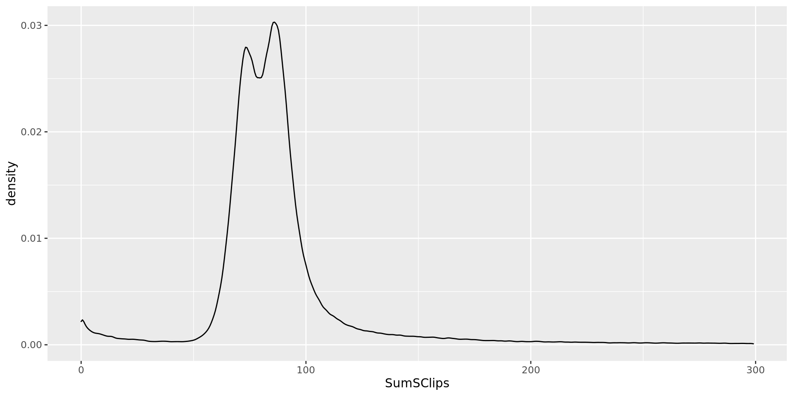
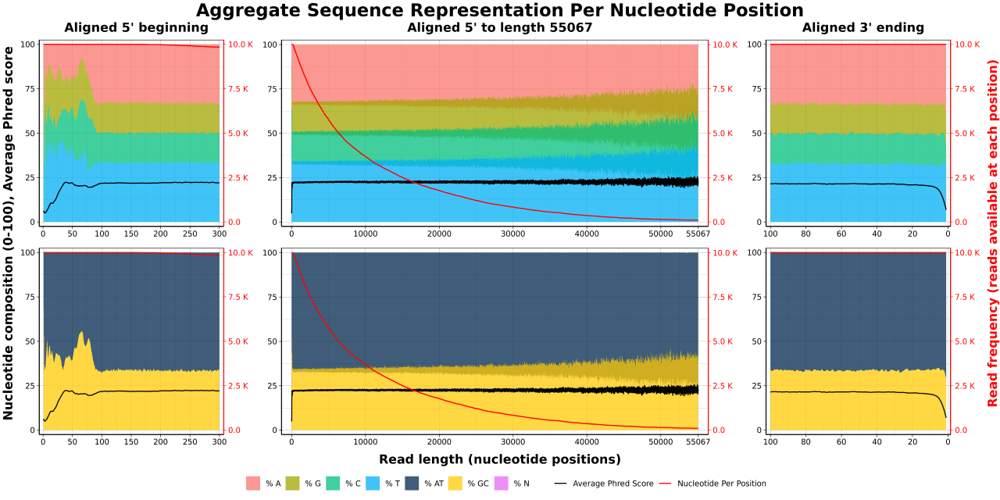
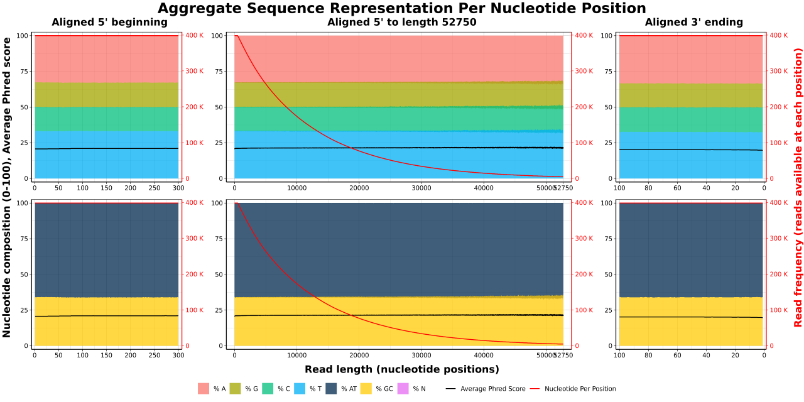
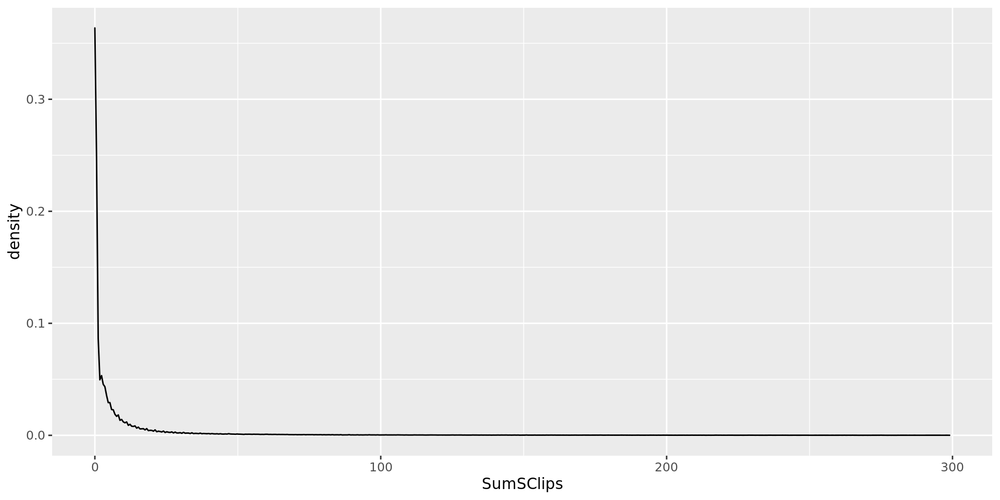
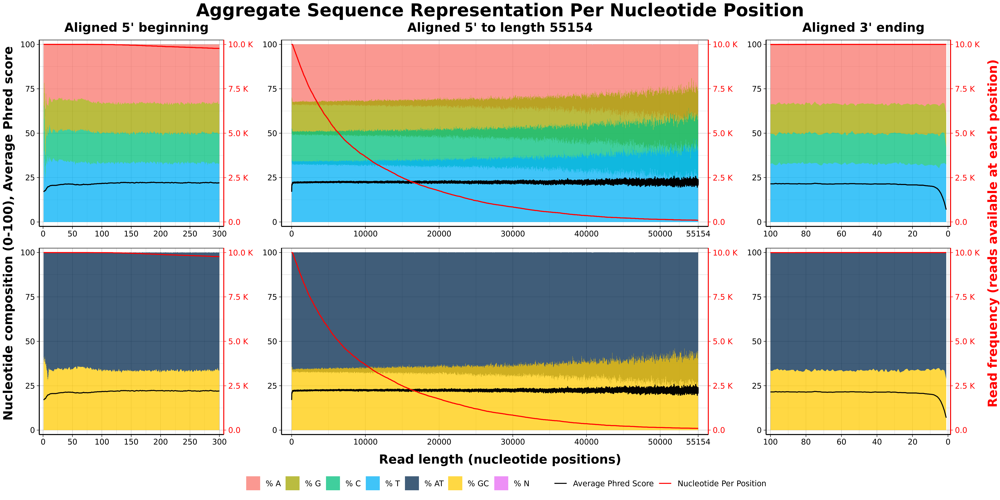
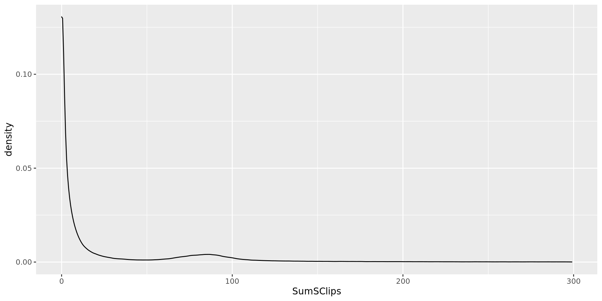
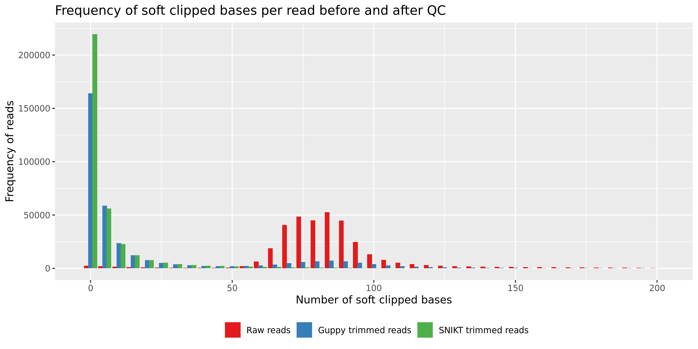

# Comparison of adapter removal performance
Created: 2022-04-13
Author: Piyush Ranjan

---

[GitHub Location](https://github.com/piyuranjan/SNIKT/blob/main/review_responses/Performance_Comparison.md): `piyuranjan/SNIKT/tree/main/review_responses/Performance_Comparison.md`  
Local Location: `$PWD/Performance_Comparison/` (disregard on GitHub)

In response to reviewer comments, we compared the performance of SNIKT with ONT's basecalling tool Guppy for adapter removal. The technique used in `guppy_barcoder`, the binary in the Guppy suite that allows barcode and adapter trimming, is alignment based. This is significantly different from SNIKT which depends on aggregation of sequence overrepresentation and corresponding user input for cleaning of reads from adapters or other systemic/technical sequence representation.

The advantages of an alignment based approach over representation based bulk trimming are the following.
1. Sequence throughput waste is minimal as the alignment tries to identify best matching positions from 5' and 3' ends.
2. A pre-processed fastq file can be re-trimmed more effectively than by a bulk trimming method.
3. Presence of an adapter in the middle of the read can be detected and removed. However, this is mostly an issue with the Illumina reads, as they tend to keep detecting false signal and consequently add them as bases to the read even when the DNA fragment has finished sequencing.

The disadvantages of an alignment based approach over bulk trimming are the following.
1. Alignment based approach depends on the knowledge of the adapter sequence. Without this knowledge they are useless.
2. Poor quality bases or technical mutations (indels/SNPs) can throw off the alignment based method since a misalignment is seen as a starting point for real sequencing data. This reduces adapter trimming accuracy often leaving traces of adapter signal in the fastq reads. This is common for Nanopore data as the error rate is higher.
3. Alignment based methods are significantly slower owing to their complexity.

<br>

## Notes about Guppy performance
Guppy is known to be inefficient in the Nanopore community at removing adapters especially if a barcode was not used. Following are some example posts from the ONT community website where users have discussed inconsistent behavior of adapter trimming via Guppy.  
https://community.nanoporetech.com/posts/guppy-adapter-trim-vs-por  
https://community.nanoporetech.com/posts/sequences-adapters-and-bar  
https://community.nanoporetech.com/posts/guppy-4-2-2-adapter-trimmi  

<br>

## Test setup

### Dataset
The dataset used for this comparison is the same SRA run ([Garg et al. 2021](https://doi.org/10.1128/MRA.00299-21)) that is used in the main paper. This sequencing run is a WGS long-read Nanopore run with 9.4.1 pore chemistry for HMW DNA extraction from *Candida albicans* CHN1 which was prepared with the SQK-RAD004 rapid DNA library preparation. Following are basic summary statistics from this fastq.
```_
$ summarizeFastq.pl SRR13441294.fastq.gz
#Dataset        #Reads  #Bases  #MinLen #MaxLen #AvgLen #AvgQ   #AvgA   #AvgC   #AvgG   #AvgT   #AvgN
SRR13441294.fastq.gz    412984  4900224854      1       166478  11865.41        21.3    32.7    16.9    17.2    33.2    0.0
```
| Dataset              | Reads  | Bases      | MinLen | MaxLen | AvgLen   | AvgQ | AvgA | AvgC | AvgG | AvgT | AvgN |
| -------------------- | ------ | ---------- | ------ | ------ | -------- | ---- | ---- | ---- | ---- | ---- | ---- |
| SRR13441294.fastq.gz | 412984 | 4900224854 | 1      | 166478 | 11865.41 | 21.3 | 32.7 | 16.9 | 17.2 | 33.2 | 0.0  |

The following adapter sequences known to be used for the [Rapid Sequencing kit family](https://community.nanoporetech.com/technical_documents/chemistry-technical-document/v/chtd_500_v1_revae_07jul2016/rapid-sequencing-kit-family) (SQK-RAD004) were gathered from the ONT community website.  
Adapter Y top, 61 nt
```_
5'- GGCGTCTGCTTGGGTGTTTAACCTTTTTTTTTTAATGTACTTCGTTCAGTTACGTATTGCT -3'
```
Adapter Y bottom, 22 nt
```_
5'- GCAATACGTAACTGAACGAAGT -3'
```
These sequences were kept in fasta and tab-separated formats. However, according to the ONT sequencing chemistry, only Adapter_Y_top is supposed to be seen in this read set.

### Device
All tests were done on a 12 core Windows laptop running WSL2 with Ubuntu 20.04 as the Linux distribution.
```_
$ lscpu | head -n 13
Architecture:                    x86_64
CPU op-mode(s):                  32-bit, 64-bit
Byte Order:                      Little Endian
Address sizes:                   39 bits physical, 48 bits virtual
CPU(s):                          12
On-line CPU(s) list:             0-11
Thread(s) per core:              2
Core(s) per socket:              6
Socket(s):                       1
Vendor ID:                       GenuineIntel
CPU family:                      6
Model:                           158
Model name:                      Intel(R) Core(TM) i7-8850H CPU @ 2.60GHz

$ uname -a
Linux MSL00332 5.10.16.3-microsoft-standard-WSL2 #1 SMP Fri Apr 2 22:23:49 UTC 2021 x86_64 x86_64 x86_64 GNU/Linux
```

### Timing of commands
Timing of the processes were done with `/usr/bin/time`. A specific format of the command was aliased as `recordStats` for repeated and consistent usage.
```_
$ alias recordStats
alias recordStats='/usr/bin/time -f "\nCommand stats:\nProc:\tElapsed Time = %E,\tAvg CPU = %P,\nMem:\tAvg Total Mem = %KKB,\tPeak Mem = %MKB,\nDisk:\tIn = %I,\tOut =%O\nExit Status: %x"'
```

### Guppy installation
Guppy binaries for the CPU version 6.1.2 (most recent as of this writing) were obtained directly from the ONT software downloads page and setup locally to be available on system PATH. `guppy_barcoder` is the binary that allows barcode and adapter trimming from the fastq reads (once they are basecalled).
```_
$ wget https://mirror.oxfordnanoportal.com/software/analysis/ont-guppy-cpu_6.1.2_linux64.tar.gz
$ tar -xvzf ont-guppy-cpu_6.1.2_linux64.tar.gz
$ mv ont-guppy-cpu 6.1.2
$ export PATH=~/Packages/ont-guppy-cpu/6.1.2/bin:${PATH}

$ guppy_barcoder --version
guppy_barcoder, part of Guppy basecalling suite, (C) Oxford Nanopore Technologies plc. Version 6.1.2+e0556ff

Use of this software is permitted solely under the terms of the end user license agreement (EULA).By running, copying or accessing this software, you are demonstrating your acceptance of the EULA.
The EULA may be found in /home/pr/Packages/ont-guppy-cpu/6.1.2/bin
```

### SNIKT installation
SNIKT was installed via Conda. However, at the time of this writing version `v0.4.3` was not released on the Anaconda. So, a local copy of the script was created and used, while all dependencies came from the Conda environment.
```_
$ mamba create -n snikt snikt
$ mamba activate snikt
$ snikt.R --version
SNIKT 0.4.2
$ wget https://raw.githubusercontent.com/piyuranjan/SNIKT/main/snikt.R
$ chmod 755 snikt.R
$ ./snikt.R --version
SNIKT 0.4.3
```

### Assessment of residual adapter content
To test how many reads have adapter content, a total of soft clipped bases per read needs to be calculated. This can be performed if the resulting reads are mapped back to the genome. Once the soft clipped bases are calculated, a difference in number of bases that are clipped can show if the adapter and/or other contamination is removed. It is important, however, to consider only those reads that have proper contiguous alignment (no secondary, no reads with supplementary) in all comparisons (only read IDs that aligned in all).
#### Minimap2 setup
Minimap2 v2.24 was setup for alignments in a Conda environment.
```_
$ mamba create -n minimap2 minimap2
$ mamba activate minimap2
$ minimap2 --version
2.24-r1122
```
The genome assembly reported along with the SRA run ([Garg et al. 2021](https://doi.org/10.1128/MRA.00299-21)) was obtained from NCBI.
```_
$ mkdir MMIdx && cd MMIdx
$ wget https://ftp.ncbi.nlm.nih.gov/genomes/all/GCA/017/309/835/GCA_017309835.1_UM_Calb_Chn1/GCA_017309835.1_UM_Calb_Chn1_genomic.fna.gz
```
A `minimap2` index was generated with this genome assembly.
```_
$ minimap2 -x map-ont -d genome.mmi GCA_017309835.1_UM_Calb_Chn1_genomic.fna.gz
```
During the alignment, the following form of command was used that discards any secondary alignments and only keeps aligned reads in SAM.
```_
$ minimap2 -ax map-ont -t 12 --secondary=no --sam-hit-only MMIdx/genome.mmi <reads.fastq[.gz]> -o <reads>_aln.sam
```
#### Picard setup
SAM records need filtering to remove any reads that had supplementary alignments to maintain consistency in soft clip base calculation. Picard was used for this filter.
Picard v2.27.1 was setup for filtering in a Conda environment.
```_
$ mamba create -n picard picard
$ mamba activate picard
$ picard FilterSamReads --version
Version:2.27.1
```
Read IDs that had more than a single match at this point in the analysis contain supplementary alignments. This was also confirmed by looking at their bit-wise flag. Such read IDs were extracted with the following form of command. A `sort` functionality is not needed, since the default alignment export from `minimap2` would be read ID sorted, instead of a position sort.
```_
$ egrep -v '^@' <reads>_aln.sam | cut -f1 | uniq -d > <reads>_suppl.txt
```
Picard was used in the following form of command to remove these read IDs that contained supplementary alignments. This produces SAM records with reads that have a contiguous alignment with the genome.
```_
$ picard FilterSamReads -I <reads>_aln.sam -O <reads>_aln_ctg.sam --READ_LIST_FILE <reads>_suppl.txt --FILTER excludeReadList
```
#### Soft clip count estimation
Once only contiguous alignments are retained from the alignment of resulting reads to genome, sum of soft clip bases per record (now per read) was calculated.
This calculation was performed with a custom Perl script in the following form.
```_
$ ./countSamSoftClip.pl <reads>_aln_ctg.sam > <reads>_sclipCount.txt
```
#### Plotting of counts
Frequency distribution of soft clip counts were plotted with R v4.1.2 in a markdown. Following is the knitted HTML from that markdown.  
[RMarkdown: ./\_attach/soft_clip_comparison.html](_attach/soft_clip_comparison.html)

<br>

## Initial assessment of adapters
An initial assessment of adapter composition was performed with Minimap2 alignment of raw reads to its genome. Only reads that mapped were kept and no secondary alignments were retained.
```_
$ minimap2 -ax map-ont -t 12 --secondary=no --sam-hit-only MMIdx/genome.mmi Fastq/Compressed/SRR13441294.fastq.gz -o SRR13441294_aln.sam
[M::main::0.090*1.00] loaded/built the index for 23 target sequence(s)
...
[M::main] Real time: 529.560 sec; CPU: 6240.178 sec; Peak RSS: 8.201 GB
```
Reads with supplementary alignments were removed.
```_
$ egrep -v '^@' SRR13441294_aln.sam | cut -f1 | uniq -d > SRR13441294_suppl.txt
$ picard FilterSamReads -I SRR13441294_aln.sam -O SRR13441294_aln_ctg.sam --READ_LIST_FILE SRR13441294_suppl.txt --FILTER excludeReadList
```
Read IDs and sum of soft clipped bases were counted.
```_
$ ./countSamSoftClip.pl SRR13441294_aln_ctg.sam > SRR13441294_sclipCount.txt
STAT: Soft clip sums reported for records: 386234
```
Counts were filtered to 300 soft clipped bases and plotted.


<br>

## Adapter assessment when trimming with SNIKT

### SNIKT trimming
Reads were trimmed with SNIKT and processed for calculation of soft clipped bases similar to the original fastq reads.
Pre-trim report was generated.
```_
$ recordStats ./snikt.R -n -o SRR13441294_preTrim Fastq/Compressed/SRR13441294.fastq.gz
SNIKT contamination report is available in: /home/pr/WD/WD8/SRR13441294_preTrim.html

Command stats:
Proc:   Elapsed Time = 1:05.10, Avg CPU = 107%,
Mem:    Avg Total Mem = 0KB,    Peak Mem = 815004KB,
Disk:   In = 491264,    Out =98192
Exit Status: 0
```
This process took about 1 minute and 815 MB in RAM memory looking at top 10,000 reads to prepare the following sequence overrepresentation report. Download locally to see.  
[SNIKT pre-trim report: ./\_attach/SRR13441294_preTrim.html](_attach/SRR13441294_preTrim.html)

Looking at this report, a more stringent trim criteria was selected for 110 bp from 5' and 20 bp from 3' end. The filter criteria was kept at 500 bp.
```_
$ recordStats ./snikt.R --filter=500 --trim5=110 --trim3=20 -o sniktQC Fastq/Compressed/SRR13441294.fastq.gz
SNIKT cleaned reads are available in:  /home/pr/WD/WD8/sniktQC.fastq
SNIKT contamination report is available in: /home/pr/WD/WD8/sniktQC.html

Command stats:
Proc:   Elapsed Time = 4:25.06, Avg CPU = 130%,
Mem:    Avg Total Mem = 0KB,    Peak Mem = 760972KB,
Disk:   In = 9575704,   Out =19081032
Exit Status: 0
```
This process took about 4.4 minutes and 761 MB in RAM memory trimming and filtering to the selected criteria and preparing the following final QC report with all reads. Download locally to see.  
[SNIKT post-trim report: ./\_attach/sniktQC.html](_attach/sniktQC.html)

This process seems to remove overrepresentation and poor quality bases.

### Read alignment and soft clip calculation
Resulting reads were aligned to the Minimap2 index.
```_
$ minimap2 -ax map-ont -t 12 --secondary=no --sam-hit-only MMIdx/genome.mmi sniktQC.fastq -o sniktQC_aln.sam
```
Supplementary reads were filtered.
```_
$ egrep -v '^@' sniktQC_aln.sam | cut -f1 | uniq -d > sniktQC_suppl.txt
$ picard FilterSamReads -I sniktQC_aln.sam -O sniktQC_aln_ctg.sam --READ_LIST_FILE sniktQC_suppl.txt --FILTER excludeReadList
```
Soft clips were counted.
```_
$ ./countSamSoftClip.pl sniktQC_aln_ctg.sam > sniktQC_sclipCount.txt
STAT: Soft clip sums reported for records: 373554
```
Counts were filtered to 300 soft clipped bases and plotted.


<br>

## Adapter assessment when trimming with Guppy
Guppy includes an alignment based adapter and barcode removal method. When used in tandem with the basecaller algorithm directly on the fast5 files, it asks for the library preparation parameters and hence knows which adapter/barcode combination is being used. Still while using it standalone (outside of an active sequencing run), there does not seem to be an option to specify the adapter sequence. So our only option was adapter detection. The executable asks for a barcoding kit which in our case could not be used as this sequencing was performed on the SQK-RAD004 rapid library prep kit and no barcoding was performed. The output from `$ guppy_barcoder --print_kits` also confirms this because it lists barcoding only kits.

### Run 1: Adapter detection, trimming
Guppy was executed to detect and trim adapter sequences in a compressed fastq file with 12 threads.
```_
$ recordStats guppy_barcoder -i Fastq/Compressed/ -s GuppyR1 -q 0 --detect_adapter --trim_adapters -t 12
[guppy/message] ONT Guppy barcoding software version 6.1.2+e0556ff
input path:         Fastq/Compressed/
save path:          GuppyR1
min. score front:   60
min. score rear:    60
[guppy/info] crashpad_handler not supported on this platform.
[guppy/message] Found 1 input files.
[guppy/info] Starting input file Fastq/Compressed/SRR13441294.fastq.gz
[guppy/warning] Plus sign not found, so setting END flag.
...
[guppy/warning] common::FastQIterable::increment: Plus sign not found, so setting END flag.
***************************************************
Done in 727590 ms.

Command stats:
Proc:   Elapsed Time = 12:12.15,        Avg CPU = 995%,
Mem:    Avg Total Mem = 0KB,    Peak Mem = 11999064KB,
Disk:   In = 2208,      Out =19551920
Exit Status: 0
```
This process finished in 12.2 minutes taking almost 12 GB in RAM memory, running for an average of 10 full threads (995% CPU usage). It ran for about 3 times longer, taking about 15 times more memory on about 10 times more CPU usage than SNIKT.  
This process produced a lot of same warning message about the fastq file. It separated the reads in 96 barcode folders when there was no barcoding used in the run. However, most of those barcodes had a tiny fraction of the reads. Most (98.6%) reads were exported under the `unclassified/` folder.  
The resulting reads were passed through only the reporting part of SNIKT to look at overrepresentation.
```_
$ ./snikt.R -n -o guppyR1_report GuppyR1/unclassified/fastq_runid_unknown_0.fastq
SNIKT contamination report is available in: /home/pr/WD/WD8/guppyR1_report.html
```
[The resulting report](_attach/guppyR1_report.html) (download locally to see) clearly shows similar overrepresentation patterns as the original fastq.

This suggests that `guppy_barcoder` absolutely failed to remove adapter sequences in this execution.

### Run 2: Adapter, barcode, primer detection, trimming
While this sequencing set was never barcoded, individuals in the ONT community have reported that Guppy performs adapter trimming when barcode detection is used. So, following that report, this test assesses Guppy's adapter cleaning when barcode and primer detection is also tuned on with 12 threads.
```_
$ recordStats guppy_barcoder -i Fastq/Compressed/ -s GuppyR2 -q 0 --detect_adapter --detect_barcodes --detect_primer --trim_adapters --trim_barcodes --trim_primers -t 12
[guppy/message] ONT Guppy barcoding software version 6.1.2+e0556ff
input path:         Fastq/Compressed/
save path:          GuppyR2
min. score front:   60
min. score rear:    60
[guppy/info] crashpad_handler not supported on this platform.
[guppy/message] Found 1 input files.
[guppy/info] Starting input file Fastq/Compressed/SRR13441294.fastq.gz
[guppy/warning] Plus sign not found, so setting END flag.
...
[guppy/warning] common::FastQIterable::increment: Plus sign not found, so setting END flag.
***************************************************
Done in 809111 ms.

Command stats:
Proc:   Elapsed Time = 13:33.34,        Avg CPU = 997%,
Mem:    Avg Total Mem = 0KB,    Peak Mem = 11918124KB,
Disk:   In = 9799456,   Out =19497240
Exit Status: 0
```
This process finished in 13.5 minutes taking almost 12 GB in RAM memory, running for an average of 10 full threads (997% CPU usage). Again in comparison to SNIKT, this process ran for about 3 times longer, taking about 15 times more memory on about 10 times more CPU usage.  
Similar to the previous execution, this process produced a lot of same warning message about the fastq file. It separated the reads in 96 barcode folders when there was no barcoding used in the run. However, most of those barcodes had a tiny fraction of the reads. Most (98.6%) reads were exported under the `unclassified/` folder.  
The resulting reads were passed through only the reporting part of SNIKT to look at overrepresentation.
```_
$ ./snikt.R -n -o guppyR2_report GuppyR2/unclassified/fastq_runid_unknown_0.fastq
SNIKT contamination report is available in: /home/pr/WD/WD8/guppyR2_report.html
```
[The resulting report](_attach/guppyR2_report.html) (download locally to see) shows that overrepresentation pattern is dampened on the 5' end suggesting that adapter trimming has taken place. The 3' end still has low quality bases.


### Run 2: Read alignment and soft clip calculation
Resulting reads were aligned to the Minimap2 index.
```_
$ minimap2 -ax map-ont -t 12 --secondary=no --sam-hit-only MMIdx/genome.mmi GuppyR2/unclassified/fastq_runid_unknown_0.fastq -o guppyR2_aln.sam
```
Supplementary reads were filtered.
```_
$ egrep -v '^@' guppyR2_aln.sam | cut -f1 | uniq -d > guppyR2_suppl.txt
$ picard FilterSamReads -I guppyR2_aln.sam -O guppyR2_aln_ctg.sam --READ_LIST_FILE guppyR2_suppl.txt --FILTER excludeReadList
```
Soft clips were counted.
```_
$ ./countSamSoftClip.pl guppyR2_aln_ctg.sam > guppyR2_sclipCount.txt
STAT: Soft clip sums reported for records: 380852
```
Counts were filtered to 300 soft clipped bases and plotted.


<br>

## Result of adapter trimming performance

Frequencies of soft clipped bases per read were collected pre-trimming and after trimming with SNIKT and Guppy. A minor fraction of reads demonstrated significantly longer soft clips suggesting spurious alignments. To remove counts from such alignments and to better view the region of histogram towards minimum soft clips, any read IDs with greater than 200 bases in soft clips were removed.  
The three datasets were merged together considering only reads that aligned to the genome assembly in all scenarios. Comparison was then made with a frequency distribution of soft clipped bases.

This figure demonstrates that SNIKT has a higher number of smaller soft clips in comparison to Guppy. This suggests that fewer reads have adapter content left after trimming. Guppy also shows a slight representation of frequencies between 70-100 bases. This is coming from reads where Guppy could not remove any adapter content likely due to sequencing errors. Notice that there is no such representation by SNIKT.


